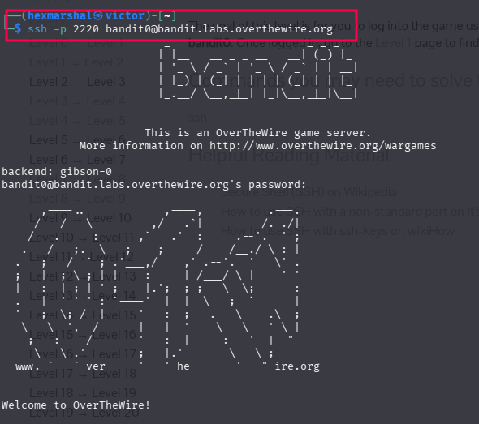

**Bandit Level 0**
**Level_Goal**
The goal of this level is for you to log into the game using SSH. At the end of this lesson, you should be able to log into remote servers using ssh.  

host:bandit.labs.overthewire.org
username: bandit0
port: 2220
To login into a remote server using SSH there are two commands to do that

1. ssh username@server_ip
2. ssh -i /path/to/private_key username@server_ip

Will be using ssh username@server_ip through out this course.

Note: If the server is on a different port, you'd need to include it in the command using the flag "-p" followed by the port number.
Server_ip can also be replace with hostname if known.

**Getting through level 0** 
 
run: ssh -p 2220 bandit0bandit.labs.overthewire.org

An option to input the password pops up password for this level being bandit0. The inputting password isn't interactive so don't worry if you can't see the hash coming up, just trust the process and insert the correct password.
Best option is to copy and paste. Using linux OS, ctrl C and ctrl V won't be effective. Use ctrl+shift+c for copy and ctrl+shift+v for paste.
Once logged in, move to the level0-level1 page to find out how to beat Level 1. 

