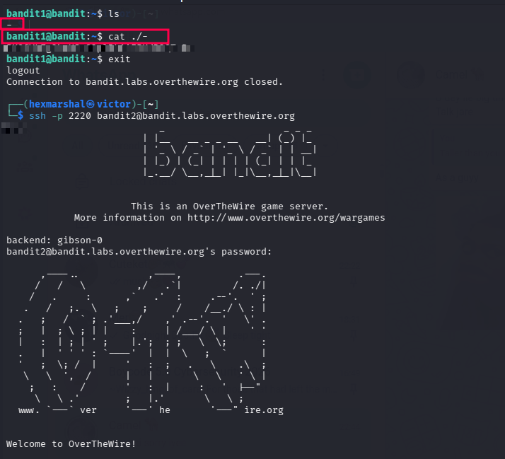

# Level1 - Level2
**Level Goal**
The password for the next level is stored in a file called - located in the home directory

**Objective** 
Candidates will learn what a dashed file is, and how to execute them i.e Read there content.

**Need to know about Dashed files**

**Dashed files(-)**: In Linux and Unix-like operating systems, a dashed file usually refers to a file whose name consists entirely of a single dash (-) or begins with a leading dash (e.g., -filename.txt). These files are notoriously tricky because the command-line interface natively interprets a dash as a prefix for an option or a flag (like -r or -f), rather than a literal file.

**Executing them:** To execute a file that starts with a dash in a Linux terminal, you must prefix the filename with a path (like ./) or use a double dash (--) so the operating system does not confuse the dash for a command-line flag. 

# SOLVING LEVEL 2
Having SSHed into bandit.labs.overthewire.org level1

**STEPS**

* ``ls`` in the home directory to see the files/folder present in it. 

    $OUTPUT: - 
* The content of the home directory is a dashed file. We can read it's content with  ``cat ./-``
Boom!!! The password is revealed. 

