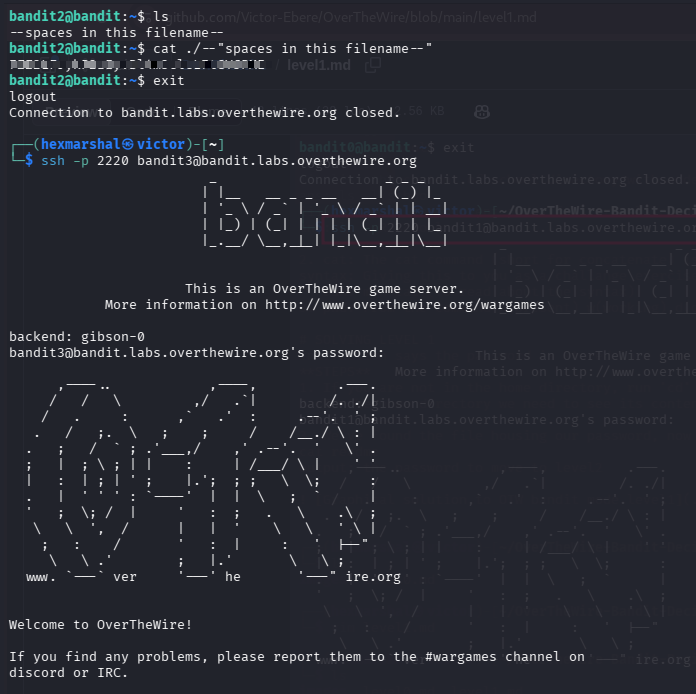

# Level2 - Level3
**Level Goal**
The password for the next level is stored in a file called --spaces in this filename-- located in the home directory

**Objective** 
Candidates will learn how to reference and read files whose names contain spaces.

**Need to know about filenames with spaces**

**Filenames with spaces**: In Linux and Unix-like operating systems, the shell uses whitespace to separate arguments. This means a filename like `spaces in this filename` is not read as one file, but as five separate arguments (`spaces`, `in`, `this`, `filename`). To reference such a file correctly, the entire filename must be wrapped in quotes (single `' '` or double `" "`), or each space must be escaped individually with a backslash (`\`).

**Executing them:** Since this particular filename also begins with a double dash (`--`), it combines two challenges at once: the leading dashes must be escaped so the shell doesn't treat them as command-line flags, and the spaces must be quoted so the shell treats the name as a single argument. Combining both, the file can be referenced as `./"--spaces in this filename--"`.

# SOLVING LEVEL 3
Having SSHed into bandit.labs.overthewire.org level2

**STEPS**

* ``ls`` in the home directory to see the files/folder present in it. 

    $OUTPUT: --spaces in this filename--
* The content of the home directory is a file with a dashed and space-separated name. We can read its content with  ``cat ./"--spaces in this filename--"``
Boom!!! The password is revealed. 

