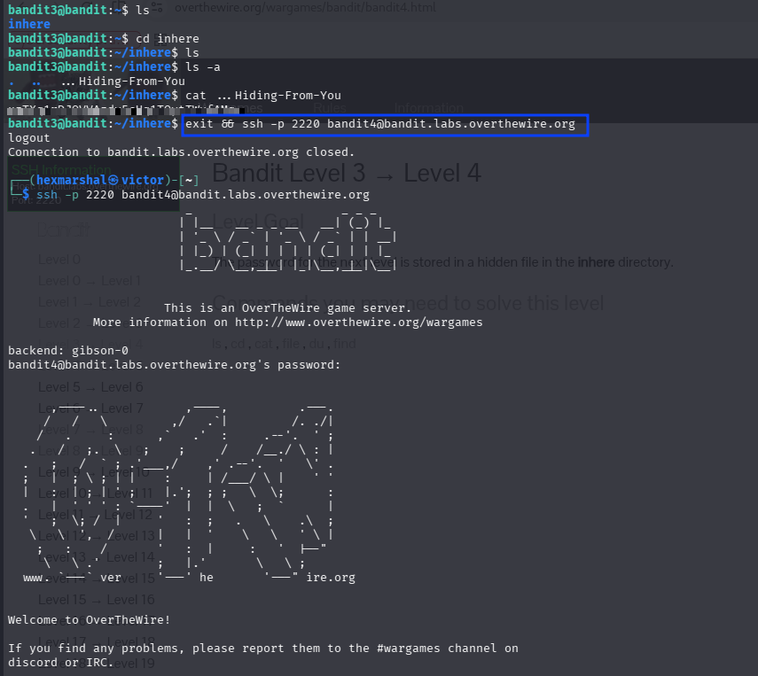

# Level3 - Level4
**Level Goal**
The password for the next level is stored in a hidden file in the `inhere` directory.

**Objective** 
Candidates will learn what a hidden file is, and how to reveal and read hidden files inside a directory.

**Need to know about hidden files**

**Hidden files**: In Linux and Unix-like operating systems, any file or directory whose name begins with a dot (`.`) is treated as "hidden" and is not shown by a plain `ls`. This is a display convention only, not a security feature. 

To reveal hidden files, pass the `-a` (all) flag to `ls`, i.e. `ls -a`.

# SOLVING LEVEL 4
Having SSHed into bandit.labs.overthewire.org level3

**STEPS**

* ``ls`` in the home directory to see the files/folder present in it. 

    $OUTPUT: inhere
* ``cd inhere`` to move into the directory, then ``ls`` shows nothing, since the file inside is hidden.
* Run ``ls -a`` to reveal hidden entries.

    $OUTPUT: .  ..  ...Hiding-From-You
* The hidden file is named `...Hiding-From-You`. We read its content with ``cat ...Hiding-From-You``
Boom!!! The password is revealed. 

