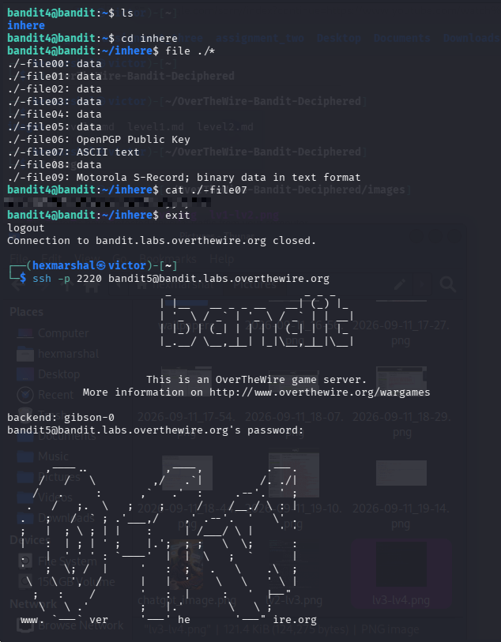

# Level4 - Level5
**Level Goal**
The password for the next level is stored in the only human-readable file in the `inhere` directory. Tip: if your terminal is messed up, try the "reset" command.

**Objective** 
Candidates will learn how to identify a file's actual type (rather than guessing from its name) using the `file` command, so they can spot the one human-readable file among many similarly-named files.

**Need to know about the `file` command**

**The `file` command**: Filenames don't guarantee what's actually inside a file. The `file` command inspects a file's content and reports its real type, e.g. `ASCII text`, `data`, `OpenPGP Public Key`, or `Motorola S-Record; binary data in text format`. Running it against a wildcard (e.g. `file ./*`) checks every file in the current directory at once, making it easy to spot the one file that is actually readable text among a batch of decoys.

# SOLVING LEVEL 5
Having SSHed into bandit.labs.overthewire.org level4

**STEPS**

* ``ls`` in the home directory to see the files/folder present in it. 

    $OUTPUT: inhere
* ``cd inhere`` to move into the directory.
* Run ``file ./*`` to check the type of every file inside at once.

    $OUTPUT: multiple files reported as `data`, one as `OpenPGP Public Key`, one as `Motorola S-Record; binary data in text format` — and `./-file07` reported as `ASCII text`.
* `./-file07` is the only human-readable file. We read its content with ``cat ./-file07``
Boom!!! The password is revealed. 

