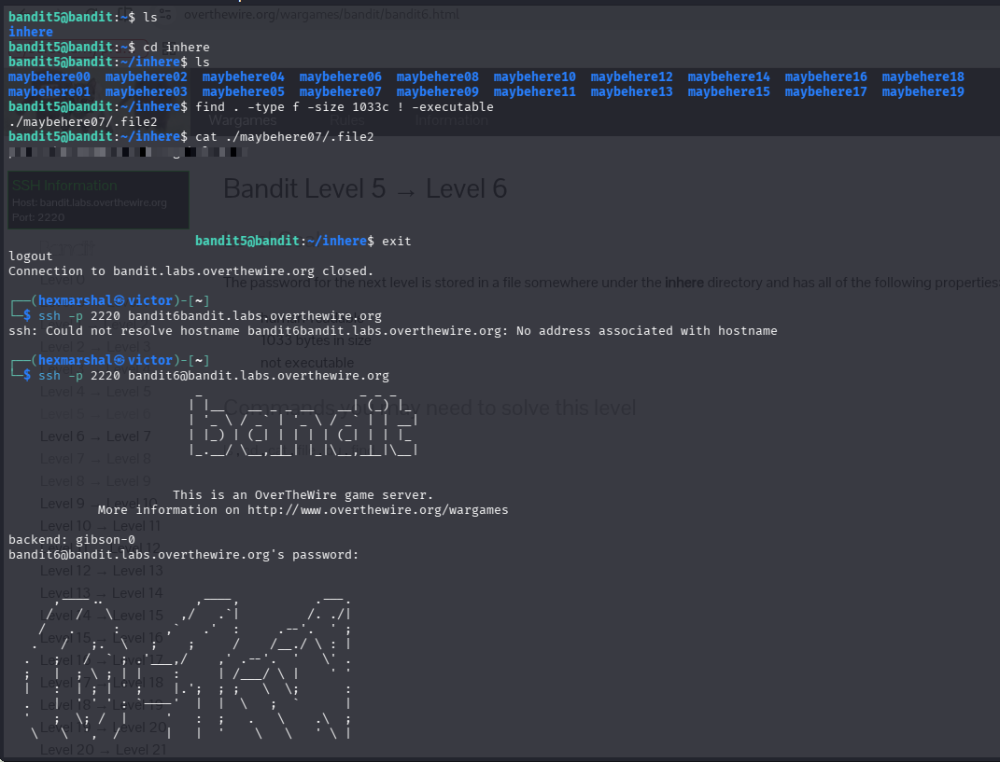

# Level5 - Level6
**Level Goal**
The password for the next level is stored in a file somewhere under the `inhere` directory and has all of the following properties:
- human-readable
- 1033 bytes in size
- not executable

**Objective** 
Candidates will learn what the `find` command is and how to use it to search recursively for a file matching multiple specific criteria at once, instead of manually checking dozens of files one by one.

**Need to know about the `find` command**

**The `find` command**: Unlike `ls`, which only lists what's inside the current directory, `find` walks through a directory and all of its subdirectories, checking every file and folder it encounters against conditions you give it. This makes it the right tool whenever you need to locate something buried several levels deep, or filter a large set of files down to the ones matching specific attributes (rather than eyeballing them one by one).

The basic syntax is:

```
find <starting-path> <tests/filters>
```

- `<starting-path>` — where to begin the search. `.` means "the current directory."
- `-type f` — only match regular files (excludes directories, symlinks, etc.).
- `-size 1033c` — only match files that are exactly a given size. The `c` suffix means the number is in bytes.
- `! -executable` — the `!` negates whatever test follows it, so this matches files that are NOT executable.

Multiple tests can be chained in one command, and by default `find` treats them as "AND" (a file must satisfy all of them). So:

``find . -type f -size 1033c ! -executable``

reads as: "starting from the current directory, find a regular file that is exactly 1033 bytes and is not executable." This single command narrows dozens of candidate files down to the one that fits every required condition, printing its path.

# SOLVING LEVEL 6
Having SSHed into bandit.labs.overthewire.org level5

**STEPS**

* ``ls`` in the home directory to see the files/folder present in it. 

    $OUTPUT: inhere
* ``cd inhere`` then ``ls`` reveals around 20 similarly-named directories/files (`maybehere00` through `maybehere19`), too many to check by hand.
* Run ``find . -type f -size 1033c ! -executable`` to search recursively for the file matching all three required properties.

    $OUTPUT: ./maybehere07/.file2
* We read its content with ``cat ./maybehere07/.file2``
Boom!!! The password is revealed. 


